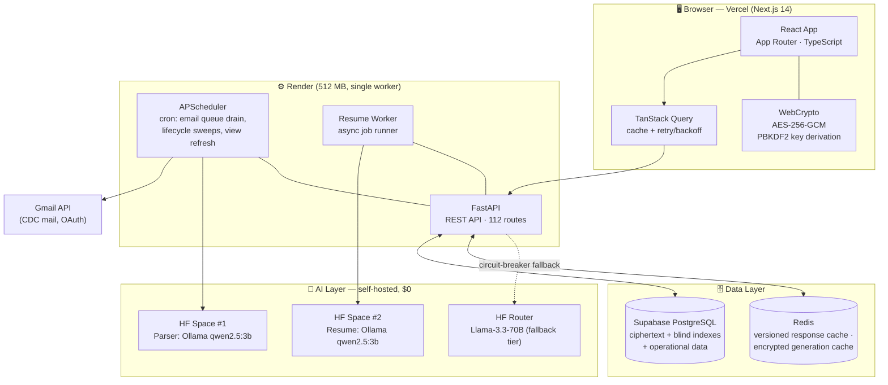
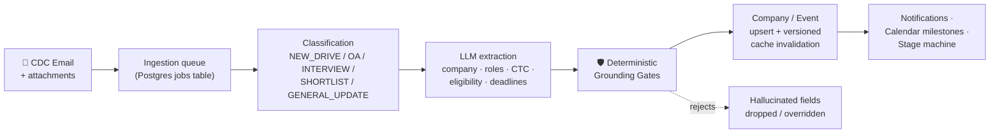
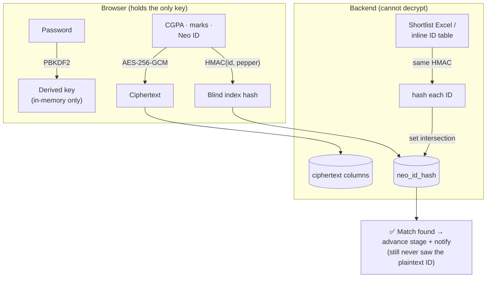
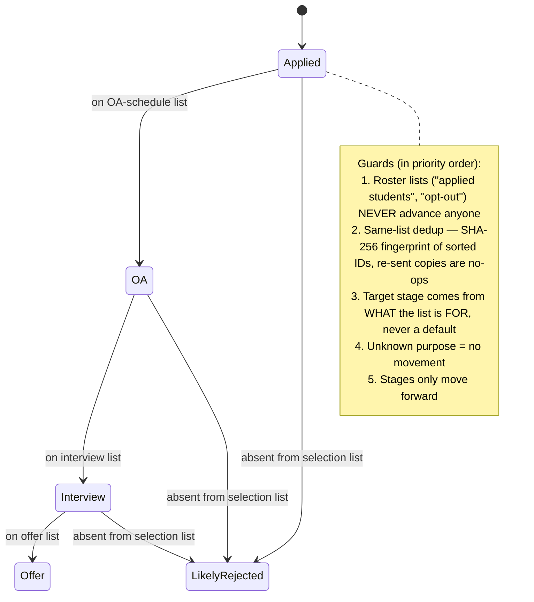
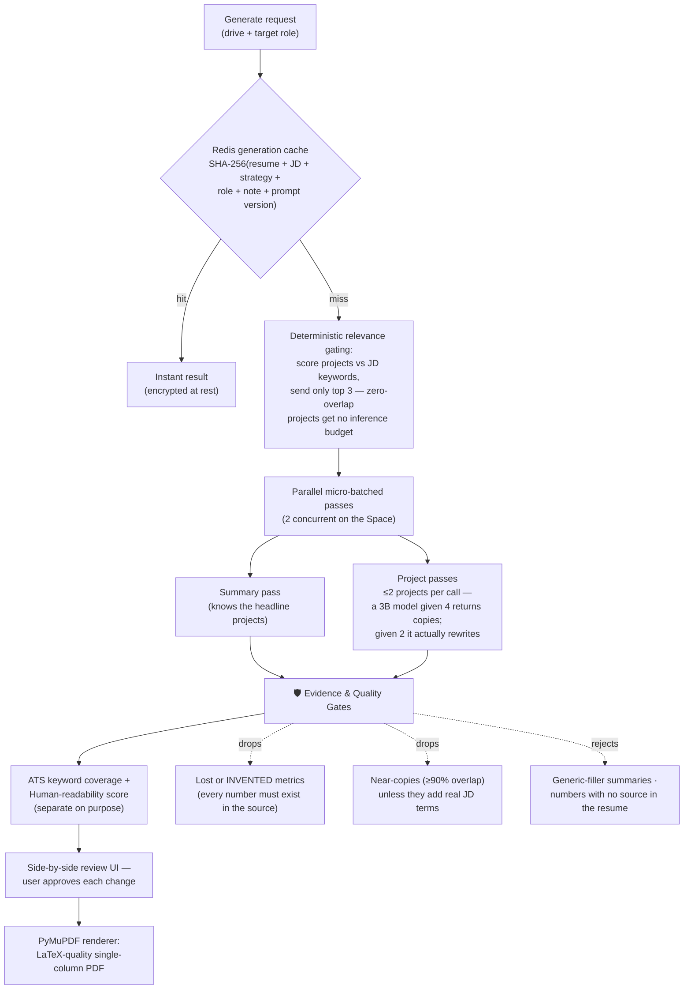
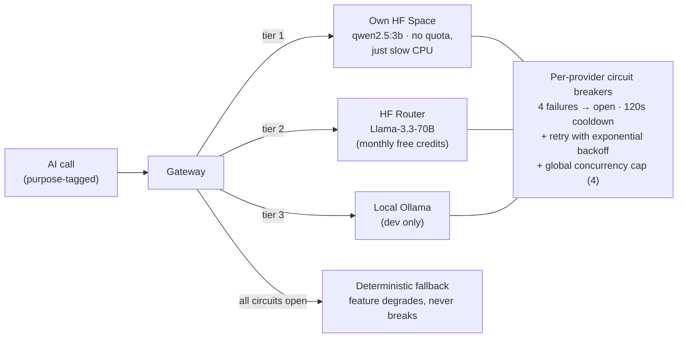

<div align="center">

# NEXTUP.AI — AI-Powered Placement Intelligence Platform

**Never miss a shortlist.** A privacy-first, zero-knowledge placement tracker that reads campus
recruitment emails, detects shortlists, verifies eligibility, and tailors ATS-optimized resumes —
built end-to-end by two students and run entirely on free-tier infrastructure.

[Live App](https://project-next-up.vercel.app) · [Backend API](https://project-nextup.onrender.com/docs)

`Next.js 14` · `FastAPI` · `PostgreSQL` · `Redis` · `Self-hosted LLMs (Ollama)` · `AES-256-GCM Zero-Knowledge Encryption`

</div>

---

## Table of Contents

1. [The Problem](#1-the-problem)
2. [What NextUp Does](#2-what-nextup-does)
3. [System Architecture](#3-system-architecture)
4. [Deep Dive: Email Intelligence Pipeline](#4-deep-dive-email-intelligence-pipeline)
5. [Deep Dive: Zero-Knowledge Encryption & Blind-Index Matching](#5-deep-dive-zero-knowledge-encryption--blind-index-matching)
6. [Deep Dive: Application Stage Machine](#6-deep-dive-application-stage-machine)
7. [Deep Dive: AI Resume Tailoring Pipeline](#7-deep-dive-ai-resume-tailoring-pipeline)
8. [Deep Dive: Multi-Provider AI Gateway](#8-deep-dive-multi-provider-ai-gateway)
9. [Architectural Decisions & Trade-offs](#9-architectural-decisions--trade-offs)
10. [Hard Problems We Hit (and How We Solved Them)](#10-hard-problems-we-hit-and-how-we-solved-them)
11. [Performance & Reliability Engineering](#11-performance--reliability-engineering)
12. [Security Model](#12-security-model)
13. [Tech Stack](#13-tech-stack)
14. [Repository Structure](#14-repository-structure)
15. [Running Locally](#15-running-locally)
16. [The Builders](#16-the-builders)

---

## 1. The Problem

Campus placements at large Indian universities run on **email**. The Career Development Centre (CDC)
sends dozens of mails a week: drive announcements, eligibility criteria buried in inconsistent
formats, registration deadlines, JD PDFs, and — critically — **shortlists as Excel attachments or
pasted ID tables** that students must manually scan for their registration number.

Miss one email and you miss an OA. Misread a "B.Tech (MECH/EEE) only" line and you waste hours
applying to a drive you're ineligible for. Every student ends up hand-maintaining spreadsheets that
go stale in days.

NextUp turns that chaotic email stream into a **structured, queryable, personal placement pipeline** —
automatically, and without the server ever being able to read a student's private academic data.

## 2. What NextUp Does

| Capability | How |
|---|---|
| **Automatic email ingestion** | Gmail OAuth → background sync polls CDC mail → queued parsing jobs |
| **Drive extraction** | Self-hosted LLM parses company, role(s), CTC, stipend, deadlines, eligibility — every field then **verified against the source text** by deterministic grounding gates |
| **Shortlist detection** | Excel attachments *and* inline ID tables are matched against the student's registration number via **blind-index hashes** (the server never sees the plaintext ID) |
| **Eligibility engine** | Multi-tier check: degree → branch → CGPA → 10th/12th cutoffs → arrears → restricted-audience drives; answers `ELIGIBLE / NOT_ELIGIBLE / UNKNOWN` with human-readable reasons |
| **Stage tracking** | Applications advance automatically (Applied → OA → Interview → Offer) driven by *what a shortlist is for*, with guards against roster mails and re-sent lists |
| **AI resume tailoring** | Per-drive resume rewriting against the actual JD, with hallucination-proof evidence grounding, ATS + readability scoring, and a professional PDF renderer |
| **Calendar & notifications** | Auto-extracted milestones with date-grounding, one-click "Add to Google Calendar" links (no OAuth verification wall), severity-ranked alerts |
| **Zero-knowledge privacy** | CGPA, marks, registration number encrypted **in the browser** (AES-256-GCM); the backend stores ciphertext it cannot decrypt |

## 3. System Architecture



**Key boundaries:**

- **The crypto boundary is the browser.** Sensitive profile fields are encrypted client-side before
  any request leaves the device; the derived key travels only as an in-memory session header, never
  to disk.
- **The AI layer is stateless and disposable.** Both inference Spaces are free CPU containers we
  own; if every provider dies, deterministic fallbacks keep each feature functional (degraded, never
  broken).
- **One 512 MB worker serves everything** — which forced most of the performance engineering
  described in [§11](#11-performance--reliability-engineering).

## 4. Deep Dive: Email Intelligence Pipeline

The heart of the system: turning free-form CDC prose into structured records **without trusting the
LLM**.



A 3B-parameter model running on a free CPU container **will** hallucinate. Instead of trusting it,
every extracted field passes through regex-based *grounding gates* that re-derive the fact from the
source text and override the model whenever they find evidence:

| Gate | Catches |
|---|---|
| **Degree extraction** | Model reading boilerplate `"in UG (for PGs)"` as an M.Tech-only drive |
| **Branch/degree separation** | `"All M.Tech CSE branches"` → degrees `[MTECH]` + branches `[CSE]`, never `MTECH` as a "branch" |
| **X/XII marks parser** | The CDC's `"% in X and XII – 60% or 6.0 CGPA"` line in all its dash-mojibake variants |
| **Date grounding** | A milestone date must be **literally written in the mail** (`17-07`, `17th July`…) or it is stripped — no invented OA dates |
| **Stage evidence** | A "Technical Interview" milestone requires interview language in the mail |
| **Raw-text quoting** | The stored eligibility text must be a quote from the mail, never model prose |
| **Restricted drives** | Women-only events are flagged → eligibility answers `UNKNOWN`, not a false `ELIGIBLE` |

Multi-role drives (one mail announcing e.g. *Software Developer* and *Product Analyst* with separate
JD PDFs) are modeled explicitly: each PDF is matched to its role by filename/content, so resume
tailoring never targets the wrong role's JD.

## 5. Deep Dive: Zero-Knowledge Encryption & Blind-Index Matching

The hardest design tension in the project: **the server must match students against shortlists it
receives — without being able to read the student IDs it is matching.**



- **Encryption:** WebCrypto AES-256-GCM in the browser; the key is derived from credentials via
  PBKDF2 and lives only in the session. A database breach yields ciphertext.
- **The matching trick:** a *blind index* — a peppered HMAC of the registration number — is stored
  alongside the ciphertext. When a shortlist arrives, the server hashes every ID in the sheet with
  the same pepper and intersects hash sets. Matching works at full fidelity; plaintext IDs never
  exist server-side.
- **The accepted trade-off:** if the user changes their password, previously encrypted fields cannot
  be re-read (there is no server-side recovery *by design*); the UI warns and re-collects them.

## 6. Deep Dive: Application Stage Machine

Stage automation is where naive designs quietly destroy user trust. Two real incidents shaped the
final machine: a **re-sent OA list** bumped students from OA straight to Interview, and an FYI mail
containing the *"final applied students list"* advanced every applicant to OA.



- The list's **purpose** drives the target stage: an OA-schedule mail's list means *attending the
  OA*, not *cleared it*. Result-type events (`OA_RESULT`) map to the next round.
- **Absence is information too:** an actively tracked student missing from a selection list is moved
  to *Likely Rejected* — softly, with a "verify against the original mail" notification, because
  inferring rejection wrongly is worse than inferring it late.
- Shortlists are parsed from **both** Excel attachments and inline email-body ID tables (a format
  the CDC switched to mid-season), with a minimum-size guard so a stray ID-like token can't
  mass-reject a cohort.

## 7. Deep Dive: AI Resume Tailoring Pipeline

Per-drive resume rewriting against the full JD text — on a free CPU container generating ~3–5
tokens/second. Every design choice below exists because of that constraint.



The **evidence-grounding layer** is the differentiator: metrics are extracted from source and output
and diffed in both directions (a rewrite may neither *lose* "200+ users" nor *invent* "improved
latency 42%"); summary claims must trace to the master resume; JD gap-keywords are offered to the
model as *hints it may only use where the student's real work supports them*, and whatever it
actually wove in is disclosed to the user for verification. If every AI provider is down, a
deterministic tailoring pass (JD-keyword reordering, all original wording) keeps the feature alive.

Two scores are shown side by side — **ATS coverage** and **human readability** — because optimizing
one silently degrades the other, and the student should see that trade-off, not be subject to it.

## 8. Deep Dive: Multi-Provider AI Gateway



Separate gateway instances for **parsing** and **resume generation** point at separate Spaces, so a
5-minute resume job can never starve the email queue. Circuit state is resettable at runtime via an
authenticated admin endpoint — no redeploy needed when a Space recovers.

## 9. Architectural Decisions & Trade-offs

Each of these was a real fork in the road; the "why" is what we'd defend in a design review.

| # | Decision | Alternatives considered | Why we chose this |
|---|---|---|---|
| 1 | **LLM extraction + deterministic grounding gates** | (a) pure regex, (b) trust the LLM | Pure regex shatters on the CDC's format drift; a 3B LLM alone hallucinates degrees, dates, and criteria. The hybrid gets LLM flexibility with regex-grade trust: the model proposes, the source text disposes. |
| 2 | **Zero-knowledge client-side crypto + blind indexes** | Server-side encryption at rest | At-rest encryption still lets a compromised server read everything. Client-side AES-256-GCM means we *cannot* leak what we *cannot* read — and the blind-index HMAC preserves the one server-side operation that matters (shortlist matching). Cost: no password recovery for encrypted fields, surfaced honestly in the UI. |
| 3 | **Self-hosted Ollama on free HF Spaces** | OpenAI/Anthropic APIs, HF serverless | A student product with per-token billing dies the month it gets users. Owning the container means zero quota — the price is CPU speed, paid for with the micro-batching + caching architecture in §7. |
| 4 | **Job queue in Postgres + APScheduler in-process** | Celery + Redis broker, cloud queues | One 512 MB instance can't afford a broker and worker fleet. A jobs table with row-level locking + cron drain gives at-least-once processing, visibility (it's just SQL), and zero extra infrastructure. |
| 5 | **Versioned Redis cache keys** (`v{n}` bumped on write) | TTL-only caching | Placement data changes in bursts (one mail → many rows). Version bumps give instant, targeted invalidation; TTL remains only as a safety net. Cache misses fall back to Postgres gracefully when Redis is down. |
| 6 | **Encrypted, prompt-versioned generation cache** | Re-run inference every time | Generate → cancel → generate again used to cost 5 minutes of CPU. Keying on SHA-256 of *all* inputs + `PROMPT_VERSION` makes reuse safe and stale-prompt-proof; storing ciphertext keeps resume content unreadable in Redis. |
| 7 | **Micro-batched prompts (≤2 projects/call)** | One mega-prompt | Empirical: qwen2.5:3b given 4 projects returns near-verbatim copies; given 2, it genuinely rewrites. Batches run 2-concurrent so wall time stays ~2 waves. |
| 8 | **Manual "Add to Google Calendar" template links** | Google Calendar API OAuth sync | The `calendar.events` scope requires Google app verification — a hard wall for a student project. The template URL needs no OAuth, no keys, no approval, and keeps the user in control of what lands in their calendar. |
| 9 | **PyMuPDF LaTeX-style renderer** | Real LaTeX toolchain in the container | TeX Live adds ~1 GB to a container that must stay lean. Hand-built typography (section rules, hanging indents, drawn bullet glyphs) gets 95% of the look for 0% of the weight. |
| 10 | **`UNKNOWN` as a first-class eligibility verdict** | Default to eligible/ineligible | When no criteria can be verified from the mail, a confident answer in either direction is a lie. `UNKNOWN` + "check the source mail" preserves trust — the product's only real currency. |

## 10. Hard Problems We Hit (and How We Solved Them)

**The hallucination war.** Early versions marked an M.Tech-only drive eligible for B.Tech students,
invented an OA date that appeared in nobody's mail, and stored LLM-fabricated eligibility text as if
quoted from the source. Each incident became a *deterministic gate* (§4) — the system now treats the
LLM as an untrusted proposal generator. This mindset shift (from "prompt better" to "verify
everything") was the single most valuable lesson of the project.

**Matching without reading.** Shortlist matching seemed to require plaintext registration numbers
server-side, which would have broken the zero-knowledge promise. The blind-index design (§5) took
several iterations — including getting word-boundary matching right so ID-like substrings in email
noise couldn't create false matches.

**The stage machine's false positives.** A re-sent OA list advancing students to Interview, and an
"applied students" roster mail advancing everyone to OA, both came from the same root cause: *the
system moved stages without understanding what a list was for.* The fix was philosophical as much as
technical — **no advancement without positive evidence of purpose** (list fingerprinting, roster
detection, event-type-driven targets, and a no-op default; §6).

**Death by N+1 on 512 MB.** The companies endpoint lazily loaded *every email body of every event of
every company* per request — on cache misses this saturated the single worker's DB pool and took the
whole API down with it (browsers reported it as CORS errors, hiding the real cause). Fixed with
batched `selectinload` + deferred heavy columns: **~30s+ → 2.3s** for the full list, then cached.

**The deploy that couldn't bind its port.** Render kept failing deploys with "no open ports
detected": startup DB migrations ran *before* uvicorn bound its socket, and psycopg2's default
connect timeout is *infinite* — one slow DB moment hung boot forever. Fixed by making startup
non-blocking (migrations in a daemon thread; port binds in <1 ms) plus a 10s connect timeout, and
`PYTHONUNBUFFERED=1` so the next silent hang is diagnosable.

**Free-tier cold starts as a UX problem.** A spun-down backend takes 30–50s to wake; the frontend's
single instant retry gave up long before, rendering false "no data" empty states. Fixed with
exponential-backoff retries (skipping 4xx), a 45s request timeout so hung sockets actually *fail*
into the retry path, and honest "server is waking up" UI states with a manual retry.

**Small-model resume quality.** The first pipeline produced near-verbatim copies presented as
"optimizations" — worse than useless. The fix was a stack of measures: relevance-gated selection
(don't spend inference on irrelevant projects), micro-batching, explicit anti-copy prompting,
bidirectional metric diffing, near-copy detection with a JD-term-gain exception, and dropping failed
rewrites *with an honest explanation* instead of showing identical before/after cards.

## 11. Performance & Reliability Engineering

Everything below exists because the entire backend runs on **one 512 MB container**:

- **Query discipline:** `selectinload` with column `defer` for all event-heavy endpoints; aggregate
  queries for sorting; the unified `/dashboard` endpoint reuses the same optimized handlers.
- **Connection budget:** pool of 5 + 10 overflow (≈15 max), 10s pool & connect timeouts, 5-min
  connection recycling to survive the DB proxy's SSL resets, `pool_pre_ping` for staleness.
- **Cache strategy:** versioned Redis keys per user/company/list with 10-min TTL safety net;
  automatic version bumps via SQLAlchemy event listeners; the app runs correctly (slower) with Redis
  completely down.
- **Boot resilience:** port binds in <1 ms; migrations/scheduler/worker start in a background
  thread; a 503 handler + client retry bridges the gap.
- **Client resilience:** TanStack Query with exponential backoff (max 5 retries, 4xx exempt), 45s
  axios timeout, cold-start-aware error states.
- **AI resilience:** per-provider circuit breakers, purpose-tagged gateways, global concurrency cap,
  deterministic fallbacks for both parsing and generation.
- **Observability:** one structured `RESUME_METRICS` log line per generation job (model, latency,
  cache hit, gate outcomes, coverage, readability) — quality drift is diagnosable from logs alone;
  ingestion jobs carry per-stage execution logs.
- **Rate limiting:** global per-IP flood guard sized to protect the thread/DB pool.

## 12. Security Model

| Layer | Mechanism |
|---|---|
| Sensitive profile data | AES-256-GCM, encrypted **in the browser**; PBKDF2-derived key, never persisted server-side |
| Shortlist matching | Peppered HMAC blind indexes — plaintext IDs never exist server-side |
| Server-side snapshots (job inputs) | Separate server-key encryption, deleted after use |
| Gmail tokens | Encrypted at rest; sync runs only while a session key is live in memory |
| AI prompt safety | User-provided notes are sanitized and framed as quoted *data*, never instructions |
| Transport / API | JWT auth, CORS allow-list, per-IP rate limiting, admin endpoints token-gated |
| PII in logs | Structured logs carry IDs and metrics, never decrypted content |

## 13. Tech Stack

| Layer | Technology |
|---|---|
| Frontend | Next.js 14 (App Router), TypeScript, TailwindCSS, TanStack Query, Zustand, Supabase Auth, WebCrypto |
| Backend | FastAPI, SQLAlchemy 2, Pydantic v2, APScheduler, psycopg2 |
| Data | Supabase PostgreSQL, Redis |
| AI | Ollama (qwen2.5 3B) on two Hugging Face Spaces, HF Router (Llama-3.3-70B fallback), spaCy, custom grounding gates |
| Documents | PyMuPDF (PDF render + parse), pdfplumber, pytesseract OCR, openpyxl/pandas (Excel shortlists) |
| Infra | Vercel (frontend), Render (backend, Docker), GitHub |

## 14. Repository Structure

```
nextup/
├── backend/
│   ├── app/
│   │   ├── api/            # REST routes: companies, applications, resumes, calendar, gmail, ...
│   │   ├── core/           # config, database, redis cache, security/crypto, rate limiting
│   │   ├── models/         # SQLAlchemy models (Company, CompanyEvent, Application, ...)
│   │   ├── schemas/        # Pydantic request/response schemas
│   │   └── services/
│   │       ├── email_parser.py      # LLM extraction + deterministic grounding gates
│   │       ├── gmail_sync.py        # ingestion queue, shortlist matching, stage machine
│   │       ├── eligibility.py       # multi-tier eligibility engine
│   │       ├── resume_pipeline.py   # tailoring passes, evidence gates, scoring, caching
│   │       ├── ai_provider.py       # multi-provider gateway + circuit breakers
│   │       ├── latex_renderer.py    # PyMuPDF LaTeX-style PDF renderer
│   │       └── ...                  # excel parsing, OCR, scoring, lifecycle sweeps
│   ├── Dockerfile          # python:3.11-slim + Ollama, model baked at build
│   └── start.sh
└── frontend/
    ├── app/                # dashboard, tracking, calendar, resume studio, profile, landing
    ├── components/         # workspace modal, review UI, tracking board, ...
    └── lib/                # api client (retry/timeout), crypto, gcal links, queries, store
```

## 15. Running Locally

**Prerequisites:** Python 3.11+, Node 18+, PostgreSQL (or SQLite for a quick start), Redis
(optional — the app degrades gracefully without it), Ollama (optional, for local AI).

```bash
# Backend
cd backend
python -m venv venv && source venv/bin/activate   # Windows: venv\Scripts\activate
pip install -r requirements.txt
uvicorn app.main:app --reload                     # http://localhost:8000/docs

# Frontend
cd frontend
npm install
npm run dev                                       # http://localhost:3000
```

<details>
<summary><b>Environment variables</b></summary>

```bash
# backend/.env
DATABASE_URL=postgresql://...        # defaults to sqlite:///./nextup.db
REDIS_URL=redis://localhost:6379     # optional
JWT_SECRET=...                       # change in prod
PEPPER=...                           # blind-index HMAC pepper — change in prod
GOOGLE_CLIENT_ID=...                 # Gmail OAuth
GOOGLE_CLIENT_SECRET=...
HUGGINGFACE_PARSER_SPACE_URL=...     # parser inference Space
HUGGINGFACE_RESUME_SPACE_URL=...     # resume inference Space
HF_API_TOKEN=...                     # HF Router fallback tier
OLLAMA_BASE_URL=http://localhost:11434   # local dev inference

# frontend/.env.local
NEXT_PUBLIC_API_URL=http://localhost:8000/api
NEXT_PUBLIC_SUPABASE_URL=...
NEXT_PUBLIC_SUPABASE_ANON_KEY=...
```

</details>

## 16. The Builders

Built by two final-year CSE students at VIT Vellore:

| | |
|---|---|
| **Sanjay J K** — AI Systems Developer | [GitHub](https://github.com/JKSANJAY27) · [LinkedIn](https://linkedin.com/in/sanjay-j-k/) · [Portfolio](https://j-k-sanjay.onrender.com/) |
| **Hariprasad T** — AI & Software Engineer | [GitHub](https://github.com/HARIPRASAD-04) · [LinkedIn](https://www.linkedin.com/in/hariprasad-t-91799b28a/) |

> **Disclaimer:** NextUp is an independent student project. It is not affiliated with, endorsed by,
> or officially connected to VIT Vellore or its Career Development Centre. Always verify placement
> information against official CDC communications.
